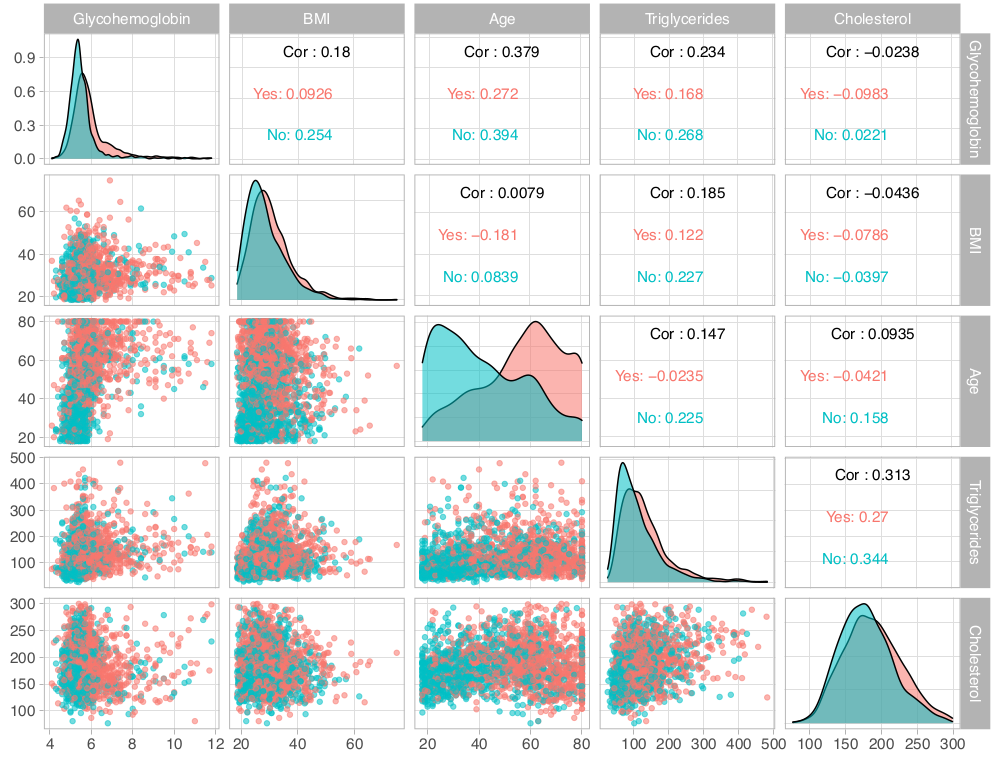
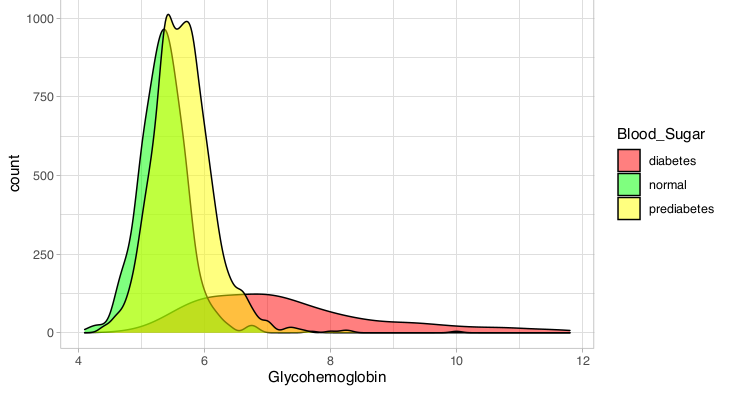

<!--This is the README for the STAT235 final project-->

# An Exploration of the National Health Examination and Nutrition Survey

*For this assignment I chose to apply methods of multicategory baseline logistic regression to NHANES data to examine associations between BMI, hypertension, glycohemoglobin, and plasma insulin levels.  Each of these measures have relevance to metabolic syndrome.*

## Abstract

Metabolic syndrome involves the intersection of obesity, cardiovascular disease, and insulin resistance.  The prevalence of metabolic syndrome worldwide, but especially in the United States, has risen due to the prominent rise in the prevalence of obesity over the past few decades.  Numerous people are now at risk of serious life-limiting chronic disease if their insulin resistance progresses to type 2 diabetes. An analysis of the 2017-2018 National Health Examination and Nutrition Survey reveals little association between hypertension and body mass index, body mass index and triglyceride or cholesterol levels, or between body mass index and blood sugar.  Thus, doubt concerning the existence of a specific role for obesity in metabolic syndrome are well founded.

## Introduction

Between 1975 and 2016 the global prevalence of obesity nearly tripled. Among children aged 5 to 19 it has more than quadrupled over the past 40 years 1.  According to the World Health Organization, we are facing a global pandemic of obesity with nearly 2 billion overweight people in the world as of 2016, of which 650 million were obese. In the American South and Midwest the prevalence of metabolic syndrome (MetS), a constellation of risk factors involving high blood pressure, altered fat metabolism, insulin resistance (diminished ability to regulate blood glucose concentration), and abdominal obesity, reaches to between 35 and 40% 2. MetS elevates an individual’s risk of diabetes by 5-fold, cardiovascular disease by 2-fold, and predisposes one to a host of other comorbidities that negatively affect lifespan 3. According to a review of the National Health and Nutrition Examination Survey (NHANES) data for the period spanning 2003 to 2014, as of 2014 there were 50 million adults in the United States with MetS and 30 million with diabetes 4.  The economic costs of obesity and its comorbidities in the United States have topped $1.7 trillion, an amount that includes nearly $481 billion in direct medical costs 5.  Thus, the economic incentives for reducing the prevalence of obesity, MetS, and related disorders as well as developing treatments to manage them in individuals who are refractory to weight loss are obvious.

The centrality of obesity in MetS has been debated and some researchers have proposed that excess caloric intake itself is its main cause.  It has been shown that caloric restriction among obese individuals is capable of reversing metabolic risk factors, suggesting that an understanding of metabolism in obese individuals is important to advance efforts to prevent the progression of MetS to diabetes and cardiovascular disease 3.  On the other hand, ectopic fat, so called for the accumulation of fat in non-adipose tissues like the liver and skeletal muscle, is associated with both abdominal obesity, high plasma concentrations of free fatty acids, and insulin resistance3, central features of MetS.

I have examined data from the 2017-2018 NHANES to explore associations between obesity, hypertension, glycohemoglobin (hemoglobin A1C), cholesterol, triglycerides, and plasma insulin concentration in a randomly selected sample of 2607 subjects from age 18 to 80 not enriched for any particular health or disease status.

## Methods

Data from the 2017-2018 NHANES were obtained from the National Center for Health Statistics
(<https://wwwn.cdc.gov/nchs/nhanes/continuousnhanes/default.aspx?BeginYear=2017>) as SAS files and were read into R (ver 3.6.1) using the read.xport command from the foreign package (ver 0.89-76).  All analyses were performed in R.  Files obtained included: Diabetes (DIQ_J), Body Measures (BMX_J), Demographic Variables and Sample Weights (DEMO_J), Plasma Fasting Glucose (GLU_J), Insulin (INS_J), Glycohemoglobin (GHB_J), and the Standard Biochemistry Profile (BIOPRO_J).  These data were of high quality and were well annotated by numerous html files available online so little cleaning was required, aside from renaming and recoding the data.  Briefly, categorical versions of the following quantitative predictors were created based on standard laboratory reference information obtained from <https://www.mayoclinic.org/tests-procedures> and other links accessible from there: body mass index (BMI), diastolic and systolic blood pressure, glycohemoglobin, and fasting blood glucose.

## Results and Discussion

The NHANES data I examined are described in Tables 1 and 2.  The sample was evenly divided among males and females and several of the conditions of interest were present in considerable proportions.  

Half of the sample could be described as having hypertension (systolic BP > 120 or diastolic BP > 80 mm Hg); 72% of respondents were at least overweight (40% obese); 42% had prediabetes or diabetes, based on hemoglobin A1C levels, which are more conservative than fasting blood glucose; 25% had at least borderline hypercholesterolemia; and 25% have at least borderline elevated triglyceride levels.  The mean age of 49.8 is typical of the population most at risk for developing metabolic syndrome.  

I began regression analysis by examining hypertension.  Given that it was a dichotomous response variable, I used ordinary logistic regression, first determining the ability of single numeric predictors to classify individuals into those with or without hypertension and then combining predictors for exhaustive subset selection via the regsubsets function in R.  Models are shown in Table 3.  I trained models on a random selection of one fifth of the dataset and tested them on the remaining observations.  The models listed in Table 3 are those resulting from the training data.  Exploratory data analysis (Figure 1) revealed that age might be the best single predictor to differentiate the presence or absence of hypertension across race and gender.  

### Figure 1. People with hypertension are most distinguished by age 

Based on its accuracy of 69.65%, the model with age was indeed the best single predictor of hypertension status with the addition of glycohemoglobin yielding a small but statistically significant (p = 5.29 x 109 by chi-square analysis) improvement in fit. Judging by AIC (439.35), the model with only age was the best model overall.

Based on AIC values there does not appear to be much of a difference between the intercept-only model and models conditioned on cholesterol or BMI, however, these single predictor models are significantly better than the null model (p = 0.01932 for the cholesterol model).  What is clear from these initial models of hypertension is the lack of any obvious dependence of hypertension on elevated BMI, cholesterol, or triglycerides, as none of these predictors seemed to be strongly associated with hypertension or were as able to accurately predict the presence of hypertension in subjects on their own, at least as well as age. Given the age only model, for every one year increase in age, the odds that a person has hypertension increase by 5%.  In contrast, although the model with only triglycerides has an accuracy of 63.5%, for every one unit increase in serum triglyceride concentration, the odds a person has hypertension are essentially unchanged (e0.0057 ~ 1).  I do not understand how this can be, unless the model is simply getting lucky.  It would be interesting to subdivide the sample by more extreme BMI, cholesterol, or triglyceride levels to see if more significant associations with hypertension can be teased out.  

I moved on to examine the ability of models to predict the incidence of either elevated BMI or elevated blood sugar using multi category baseline logistic regression, as shown in Table 4. Glycohemoglobin, more commonly referred to as hemoglobin A1C is indeed a fairly accurate (60.23%) predictor of prediabetes or diabetes on its own (Figure 2).  When combined with age, there is a significant improvement in accuracy to 64.34% (p = 6.25 x 10-11).  

### Figure 2. Glycohemoglobin reflects diabetes status

The addition of triglycerides rather than age to the model with glycohemoglobin yields essentially the same improvement in accuracy.  There was some instability in the model with glycohemoglobin, as judged by the very large intercept for the diabetes category of the blood sugar response variable as well as for its very large odds ratio (Table 5).  For every one unit increase (one tenth of of one percent) in hemoglobin A1C, the odds a person has prediabetes increase by 5.5-fold, while their odds of having diabetes increases more than 70-fold.  Based on the plot on the following page it is not obvious to me why there was instability in the intercept for the diabetes category.  

As shown in Table 4, triglycerides were not able to accurately predict elevated BMI (accuracy of less than 50%). For every one mg increase in serum triglycerides per dL of plasma, the odds an individual is overweight or obese increase by only 1%, and despite their ability to predict hypertension, the odds a person has hypertension are essentially unchanged.  In contrast, insulin might provide a bridge between elevated BMI and elevated blood sugar, given that insulin on its own predicts elevated BMI with an accuracy more than 10% higher than does serum triglyceride level. For every one unit increase in insulin concentration, the odds a person is overweight increase by 16% and the odds they are obese increase by 26% (Table 5). Elevated insulin is a hallmark of insulin resistance, a key feature of metabolic syndrome, and may result from some interaction between the insulin signaling system and increased adiposity.  It would be interesting to repeat these analyses on a selection of survey participants with the highest insulin levels and/or the highest BMIs to see if a more obvious association between BMI and elevated blood sugar could be found.  

## Conclusion

Metabolic syndrome is a complex chronic condition that may take years to fully develop.  It seems clear that many of the NHANES participants might qualify for a diagnosis of metabolic syndrome based on BMI, glycohemoglobin, insulin concentration, and blood pressure.  My brief analysis does not establish a strong link between diabetes and obesity, or diabetes and triglycerides or cholesterol, even though obesity and altered fat metabolism are key features of metabolic syndrome.  Teasing out the relationships between the components of this complex disorder may require long term study of the chronically obese. Furthermore, there may be genetic contributions to metabolic syndrome and the relationship between obesity and diabetes that are not adequately represented in the NHANES cohort.  

## References

1. Obesity and overweight. <https://www.who.int/news-room/fact-sheets/detail/obesity-and-overweight>.
2. Gurka, M. J., Filipp, S. L. & DeBoer, M. D. Geographical variation in the prevalence of obesity, metabolic syndrome, and diabetes among US adults. Nutr. Diabetes 8, 14 (2018).
3. Grundy, S. M. Metabolic syndrome update. Trends Cardiovasc. Med. 26, 364–373 (2016).
4. Trends in Lipids, Obesity, Metabolic Syndrome, and Diabetes Mellitus in the United States: An NHANES Analysis (2003‐2004 to 2013‐2014) - Palmer - 2019 - Obesity - Wiley Online Library. <https://onlinelibrary.wiley.com/doi/full/10.1002/oby.22370>.
5. Economic impact of excess weight now exceeds $1.7 trillion: Costs include $1.24 trillion in lost productivity, according to study documenting role of obesity and overweight in chronic diseases. ScienceDaily <https://www.sciencedaily.com/releases/2018/10/181030163458.htm>.